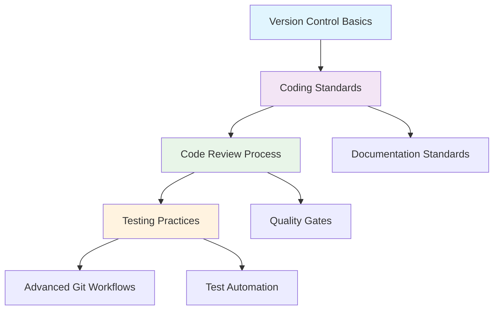

# Development Practices

> **Navigation:** [Home](../README.md) > Development Practices  
> **Related:** [Quality Assurance](../03-quality-assurance/README.md) | [Standards & Guidelines](../07-standards-guidelines/README.md) | [Tools & Technologies](../08-tools-technologies/README.md)

## Overview

Development practices form the foundation of software engineering excellence. This section encompasses the core methodologies, processes, and standards that guide how we write, review, test, and manage code throughout the software development lifecycle.

Our development practices focus on:
- **Code Quality**: Establishing and maintaining high standards for code craftsmanship
- **Collaboration**: Enabling effective teamwork through structured review processes
- **Reliability**: Ensuring consistent behavior through comprehensive testing
- **Traceability**: Maintaining clear version control and change management

## Practice Areas

| Practice Area | Status | Priority | Last Updated | Quick Access |
|---------------|--------|----------|--------------|--------------|
| [Coding Standards](coding-standards/README.md) | 🔄 In Progress | High | 2024-01-15 | [Style Guide](coding-standards/style-guide.md) |
| [Code Review Process](code-review-process/README.md) | 📋 Planning | High | 2024-01-10 | [Review Checklist](code-review-process/checklist.md) |
| [Version Control](version-control/README.md) | 📋 Planning | High | 2024-01-08 | [Git Workflow](version-control/git-workflow.md) |
| [Testing Practices](testing-practices/README.md) | 📋 Planning | Medium | 2024-01-05 | [Test Strategy](testing-practices/strategy.md) |

**Status Legend:** 🔄 In Progress | 📋 Planning | ✅ Complete | 🚧 Under Review

## Learning Path

## Quick Access

### Most Frequently Used Documents
- **[Git Workflow Guide](version-control/git-workflow.md)** - Daily git operations and branching strategy
- **[Code Review Checklist](code-review-process/checklist.md)** - Essential items to verify during reviews
- **[Style Guide Summary](coding-standards/style-guide.md)** - Quick reference for code formatting
- **[Testing Standards](testing-practices/standards.md)** - What and how to test

### Emergency References
- **[Hotfix Process](version-control/hotfix-process.md)** - Critical bug fix procedures
- **[Code Review Escalation](code-review-process/escalation.md)** - When reviews need management involvement
- **[Rollback Procedures](version-control/rollback-procedures.md)** - Reverting problematic changes

## Getting Started

### For New Team Members
1. **Week 1**: Complete [Version Control Basics](version-control/basics.md) training
2. **Week 2**: Review [Coding Standards](coding-standards/README.md) and setup IDE configurations
3. **Week 3**: Shadow experienced developers during [Code Reviews](code-review-process/README.md)
4. **Week 4**: Begin participating in code reviews and writing tests

### For Existing Teams
1. **Assessment**: Use our [Development Maturity Assessment](../09-reference-materials/checklists/dev-maturity-checklist.md)
2. **Gap Analysis**: Identify areas for improvement based on assessment results
3. **Implementation**: Start with highest impact practices (typically version control and code review)
4. **Monitoring**: Track progress using [Development Metrics](../03-quality-assurance/quality-metrics/development-metrics.md)

## Maturity Indicators

### Level 1: Basic (Getting Started)
- [ ] Version control system in use
- [ ] Basic coding standards document exists
- [ ] Informal code review process
- [ ] Some unit tests written

### Level 2: Structured (Improving)
- [ ] Documented branching strategy
- [ ] Enforced coding standards with linting
- [ ] Formal code review process with checklists
- [ ] Test coverage tracking

### Level 3: Advanced (Optimizing)
- [ ] Automated code quality gates
- [ ] Advanced git workflows (feature flags, etc.)
- [ ] Comprehensive test pyramid
- [ ] Continuous improvement metrics

### Level 4: Expert (Leading)
- [ ] Fully automated development pipeline
- [ ] Custom tooling for team efficiency
- [ ] Cross-team knowledge sharing
- [ ] Industry best practice contributions

## Related Sections

- **[Quality Assurance](../03-quality-assurance/README.md)**: Testing strategies and quality metrics
- **[Standards & Guidelines](../07-standards-guidelines/README.md)**: Organizational standards and compliance
- **[Tools & Technologies](../08-tools-technologies/README.md)**: Development tools and environment setup
- **[Team Processes](../06-team-processes/README.md)**: Agile processes and team collaboration

## Best Practices Summary

1. **Version Control Everything**: Code, configuration, documentation, and infrastructure
2. **Review All Changes**: No code reaches production without peer review
3. **Test Early and Often**: Unit tests, integration tests, and automated testing
4. **Maintain Standards**: Consistent coding style and documentation practices
5. **Continuous Improvement**: Regular retrospectives and practice refinement

---

**Next Steps:**
- Review the [Development Maturity Assessment](../09-reference-materials/checklists/dev-maturity-checklist.md)
- Explore specific practice areas based on your team's current needs
- Join our [Development Community](../06-team-processes/communication-standards/channels.md) for ongoing discussions

**Last Updated:** January 2024  
**Maintained By:** Engineering Standards Team  
**Review Cycle:** Quarterly