# Git Flow Branching Strategy

## Table of Contents
- [What & Why](#what--why)
- [Implementation Steps](#implementation-steps)
- [Tools & Technologies](#tools--technologies)
- [Quality Gates](#quality-gates)
- [Common Pitfalls](#common-pitfalls)
- [Success Metrics](#success-metrics)
- [Branch Management](#branch-management)
- [Visual Workflows](#visual-workflows)
- [Examples & Scenarios](#examples--scenarios)
- [Troubleshooting](#troubleshooting)
- [References](#references)

## What & Why

### Definition

Git Flow is a branching model for [`git`](git) that provides a robust framework for managing feature development, releases, and hotfixes in a collaborative environment. It defines specific branch types and workflows that enable parallel development while maintaining code stability.

### Core Benefits

**🎯 Parallel Development**
- Multiple features can be developed simultaneously without interference
- Clear isolation between feature development and stable code
- Reduced merge conflicts through structured workflow

**🚀 Release Management**
- Predictable release cycles with dedicated release branches
- Ability to continue feature development while preparing releases
- Clean separation between development and production-ready code

**🛡️ Production Stability**
- Main branch always reflects production-ready state
- Hotfix capability for critical production issues
- Quality gates at each merge point

**👥 Team Collaboration**
- Clear ownership and responsibility for each branch type
- Standardized workflow reduces onboarding time
- Enhanced code review process through structured merges

### When to Use Git Flow

✅ **Ideal Scenarios:**
- Teams with 3+ developers
- Scheduled releases (weekly, monthly, quarterly)
- Need for parallel feature development
- Production systems requiring stability
- Complex projects with multiple integration points

❌ **Consider Alternatives When:**
- Continuous deployment to production
- Small team (1-2 developers)
- Simple projects with minimal dependencies
- Rapid prototyping or experimental projects

## Implementation Steps

### Step 1: Repository Setup

```bash
# Clone repository and initialize Git Flow
git clone <repository-url>
cd <project-name>

# Initialize Git Flow (interactive setup)
git flow init

# Or initialize with default branch names
git flow init -d
```

### Step 2: Configure Branch Protection

```bash
# Protect main branch (via GitHub/GitLab interface or CLI)
# - Require pull request reviews
# - Require status checks to pass
# - Require branches to be up to date
# - Restrict pushes to main branch
```

### Step 3: Feature Development Workflow

```bash
# Start new feature
git flow feature start FEATURE-123-user-authentication

# Work on feature
git add .
git commit -m "feat(auth): implement JWT token validation"
git push origin feature/FEATURE-123-user-authentication

# Create pull request for code review
# After approval, finish feature
git flow feature finish FEATURE-123-user-authentication
```

### Step 4: Release Management Workflow

```bash
# Start release branch
git flow release start 1.2.0

# Prepare release (version bumps, documentation, testing)
git add .
git commit -m "chore(release): prepare version 1.2.0"
git push origin release/1.2.0

# After release testing, finish release
git flow release finish 1.2.0

# Push all branches and tags
git push origin develop
git push origin main
git push --tags
```

### Step 5: Hotfix Workflow

```bash
# Start hotfix from main
git flow hotfix start 1.2.1

# Fix critical issue
git add .
git commit -m "fix(security): patch XSS vulnerability in user input"

# Finish hotfix
git flow hotfix finish 1.2.1

# Push all changes
git push origin develop
git push origin main
git push --tags
```

## Tools & Technologies

### Required Tools

| Tool | Version | Purpose |
|------|---------|---------|
| [`Git`](git) | 2.30+ | Version control system |
| [`git-flow`](git-flow) | 1.12+ | Git Flow extensions |

### Installation

**macOS:**
```bash
brew install git-flow-avh
```

**Windows:**
```bash
# Using Chocolatey
choco install gitflow-avh

# Using Git Bash (manual)
git clone https://github.com/petervanderdoes/gitflow-avh.git
cd gitflow-avh
make install
```

**Linux (Ubuntu/Debian):**
```bash
sudo apt-get install git-flow
```

### Recommended IDE Extensions

| IDE | Extension | Features |
|-----|-----------|----------|
| VS Code | GitLens | Branch visualization, commit history |
| VS Code | Git Flow | Built-in Git Flow commands |
| IntelliJ | Git Flow Integration | GUI for Git Flow operations |
| Sublime Text | SublimeGit | Git Flow support |

### Git Configuration

```bash
# Set up Git Flow aliases
git config --global alias.fs 'flow feature start'
git config --global alias.ff 'flow feature finish'
git config --global alias.rs 'flow release start'
git config --global alias.rf 'flow release finish'
git config --global alias.hs 'flow hotfix start'
git config --global alias.hf 'flow hotfix finish'

# Configure merge strategy
git config --global merge.ff false
git config --global pull.rebase true
```

## Quality Gates

### ✅ Pre-merge Checklist

**Feature Branches:**
- [ ] Code follows [coding standards](../coding-standards/README.md)
- [ ] All tests pass locally and in CI
- [ ] Code review completed by 2+ reviewers
- [ ] No merge conflicts with develop branch
- [ ] Feature documentation updated
- [ ] Security review completed (if applicable)

**Release Branches:**
- [ ] Version number updated in all relevant files
- [ ] Release notes documented
- [ ] Full regression testing completed
- [ ] Performance benchmarks meet requirements
- [ ] Security scan passed
- [ ] Database migrations tested (if applicable)
- [ ] Deployment runbook updated

**Hotfix Branches:**
- [ ] Critical issue clearly identified and documented
- [ ] Minimal scope - only addresses the critical issue
- [ ] Emergency approval obtained
- [ ] Rollback plan documented
- [ ] Post-deployment monitoring plan ready

### Branch Merge Requirements

| Branch Type | Required Reviewers | Auto-merge | Squash |
|-------------|-------------------|------------|--------|
| feature → develop | 2 | ❌ | ✅ |
| release → main | 3 | ❌ | ❌ |
| release → develop | 1 | ✅ | ❌ |
| hotfix → main | 2 | ❌ | ❌ |
| hotfix → develop | 1 | ✅ | ❌ |

## Common Pitfalls

### 🚫 Pitfall 1: Working Directly on Main/Develop

**Problem:** Developers push commits directly to main or develop branches
**Impact:** Bypasses code review, breaks CI/CD, creates deployment risks

**Solution:**
```bash
# Protect branches via repository settings
# Use branch protection rules:
# - Require pull request reviews
# - Dismiss stale reviews
# - Require status checks
```

### 🚫 Pitfall 2: Long-lived Feature Branches

**Problem:** Feature branches exist for weeks/months without merging
**Impact:** Merge conflicts, integration nightmares, delayed feedback

**Solution:**
- Break large features into smaller, mergeable pieces
- Regular rebasing against develop branch
- Feature flags for incomplete functionality

```bash
# Rebase feature branch regularly
git checkout feature/FEATURE-123
git rebase develop
```

### 🚫 Pitfall 3: Inconsistent Branch Naming

**Problem:** Ad-hoc naming conventions across team members
**Impact:** Poor discoverability, unclear ownership, automation failures

**Solution:** Enforce naming conventions through automation
```bash
# Example Git hook to validate branch names
#!/bin/sh
branch=$(git rev-parse --abbrev-ref HEAD)
valid_pattern="^(feature|bugfix|hotfix|release)\/[A-Z]+-[0-9]+-[a-z0-9-]+$"

if [[ ! $branch =~ $valid_pattern ]]; then
  echo "Branch name '$branch' does not follow naming convention"
  echo "Expected: type/TICKET-123-short-description"
  exit 1
fi
```

### 🚫 Pitfall 4: Merge vs Rebase Confusion

**Problem:** Inconsistent merge strategies create messy history
**Impact:** Difficult code archaeology, unclear change attribution

**Solution:** Clear guidelines per branch type
- Features: Squash and merge to develop
- Releases: Merge commit to preserve history
- Hotfixes: Merge commit for traceability

### 🚫 Pitfall 5: Release Branch Scope Creep

**Problem:** Adding new features to release branches
**Impact:** Unstable releases, delayed deployments, regression risks

**Solution:**
- Only bug fixes and preparation tasks in release branches
- New features go to develop via feature branches
- Document release scope upfront

## Success Metrics

### 📊 Key Performance Indicators

**Development Velocity:**
- Average feature branch lifespan: < 5 days
- Time from feature complete to production: < 2 weeks
- Number of merge conflicts per week: < 5

**Code Quality:**
- Code review coverage: 100%
- Automated test coverage: > 80%
- Critical bugs in production: < 1 per release

**Team Collaboration:**
- Pull request review time: < 24 hours
- Number of hotfixes per month: < 2
- Developer satisfaction score: > 4/5

### 📈 Monitoring Dashboard


### 📋 Weekly Review Questions

1. **Process Adherence:**
   - Are all merges following the prescribed workflow?
   - Any branches violating naming conventions?
   - Code review requirements being met?

2. **Bottlenecks:**
   - Which branches are blocked and why?
   - Are releases being delayed by process issues?
   - Any recurring merge conflict patterns?

3. **Team Health:**
   - Is the branching strategy serving the team well?
   - Any pain points or suggestions for improvement?
   - Training needs identified?

## Branch Management

### Branch Types and Purposes

```mermaid
graph TD
    A[main] --> B[🔴 Production Ready]
    C[develop] --> D[🟡 Integration Branch]
    E[feature/*] --> F[🟢 New Features]
    G[release/*] --> H[🔵 Release Preparation]
    I[hotfix/*] --> J[🟠 Critical Fixes]
    
    style A fill:#ff9999
    style C fill:#ffff99
    style E fill:#99ff99
    style G fill:#9999ff
    style I fill:#ffcc99
```



### Naming Conventions

| Branch Type | Pattern | Example | Purpose |
|-------------|---------|---------|---------|
| Feature | `feature/TICKET-###-description` | `feature/JIRA-123-user-login` | New functionality |
| Bugfix | `bugfix/TICKET-###-description` | `bugfix/BUG-456-password-reset` | Bug fixes in develop |
| Release | `release/X.Y.Z` | `release/2.1.0` | Release preparation |
| Hotfix | `hotfix/X.Y.Z` | `hotfix/2.0.1` | Critical production fixes |
| Support | `support/X.Y` | `support/2.0` | Long-term support versions |

### Branch Lifecycle

**Feature Branch Lifecycle:**
```bash
# 1. Create and checkout
git flow feature start JIRA-123-user-authentication

# 2. Develop and commit
git add -A
git commit -m "feat(auth): implement JWT middleware"

# 3. Push for backup/collaboration
git push origin feature/JIRA-123-user-authentication

# 4. Create pull request (via GitHub/GitLab)
# 5. Code review and approval
# 6. Merge to develop
git flow feature finish JIRA-123-user-authentication
```

**Release Branch Lifecycle:**
```bash
# 1. Create release branch
git flow release start 2.1.0

# 2. Prepare release
echo "2.1.0" > VERSION
git commit -am "chore(release): bump version to 2.1.0"

# 3. Test and stabilize
git commit -am "fix(release): resolve integration test failures"

# 4. Finish release
git flow release finish 2.1.0

# 5. Deploy to production
```

### Merge Strategies

**Squash and Merge (Features):**
- Combines all feature commits into single commit
- Clean, linear history
- Easier to revert entire features

```bash
# Automatic squash via GitHub/GitLab
# Or manual squash:
git checkout develop
git merge --squash feature/JIRA-123-user-auth
git commit -m "feat(auth): implement user authentication system"
```

**Merge Commit (Releases/Hotfixes):**
- Preserves branch history
- Shows clear integration points
- Better for audit trails

```bash
git checkout main
git merge --no-ff release/2.1.0
git tag -a v2.1.0 -m "Release version 2.1.0"
```

## Visual Workflows

### Git Flow Overview

```mermaid
gitgraph
    commit id: "Initial"
    
    branch develop
    checkout develop
    commit id: "Setup"
    
    branch feature/auth
    checkout feature/auth
    commit id: "Auth logic"
    commit id: "Tests"
    
    checkout develop
    merge feature/auth
    
    branch release/1.0
    checkout release/1.0
    commit id: "Version bump"
    commit id: "Bug fixes"
    
    checkout main
    merge release/1.0
    commit id: "v1.0.0" tag: "v1.0.0"
    
    checkout develop
    merge release/1.0
    
    checkout main
    branch hotfix/1.0.1
    commit id: "Critical fix"
    
    checkout main
    merge hotfix/1.0.1
    commit id: "v1.0.1" tag: "v1.0.1"
    
    checkout develop
    merge hotfix/1.0.1
```

### Release Workflow Timeline


### Hotfix Process Flow

```mermaid
flowchart TD
    A[🚨 Critical Issue Reported] --> B{Issue Severity?}
    B -->|Critical| C[Create Hotfix Branch]
    B -->|Non-Critical| D[Add to Backlog]
    
    C --> E[Develop Fix]
    E --> F[Local Testing]
    F --> G{Tests Pass?}
    G -->|No| E
    G -->|Yes| H[Create Pull Request]
    
    H --> I[Emergency Code Review]
    I --> J{Approved?}
    J -->|No| K[Address Feedback]
    K --> I
    J -->|Yes| L[Merge to Main]
    
    L --> M[Deploy to Production]
    M --> N[Verify Fix]
    N --> O[Merge to Develop]
    O --> P[Monitor & Document]
    
    style A fill:#ff6b6b
    style M fill:#51cf66
    style P fill:#74c0fc
```



## Examples & Scenarios

### Scenario 1: Feature Development

**Context:** Implementing user profile management feature

```bash
# 1. Start feature branch
git flow feature start PROFILE-456-user-profile-management
# Creates: feature/PROFILE-456-user-profile-management

# 2. Implement feature with multiple commits
git add src/components/UserProfile.tsx
git commit -m "feat(profile): create UserProfile component"

git add src/api/profileApi.ts
git commit -m "feat(profile): implement profile API client"

git add src/__tests__/UserProfile.test.tsx
git commit -m "test(profile): add UserProfile component tests"

# 3. Push for backup and collaboration
git push origin feature/PROFILE-456-user-profile-management

# 4. Create pull request
# - Title: "feat(profile): implement user profile management"
# - Description: Links to PROFILE-456, testing instructions
# - Reviewers: assigned automatically

# 5. Address code review feedback
git add src/components/UserProfile.tsx
git commit -m "refactor(profile): extract profile validation logic"

# 6. After approval, finish feature
git flow feature finish PROFILE-456-user-profile-management
# Merges to develop with squashed commit
```

### Scenario 2: Release Preparation

**Context:** Preparing version 3.2.0 release with multiple features

```bash
# 1. Create release branch when features are complete
git flow release start 3.2.0
# Creates: release/3.2.0

# 2. Update version numbers
echo "3.2.0" > VERSION
npm version 3.2.0 --no-git-tag-version
git commit -am "chore(release): bump version to 3.2.0"

# 3. Update changelog
git add CHANGELOG.md
git commit -m "docs(release): update changelog for 3.2.0"

# 4. Run full test suite
npm run test:full
npm run test:e2e

# 5. Fix any integration issues
git add src/config/apiEndpoints.ts
git commit -m "fix(release): correct API endpoint configuration"

# 6. Final preparation
git add docs/deployment.md
git commit -m "docs(release): update deployment instructions"

# 7. Finish release
git flow release finish 3.2.0
# Merges to main and develop, creates tag v3.2.0

# 8. Push everything
git push origin develop main --tags

# 9. Trigger deployment pipeline
# CI/CD picks up the new tag and deploys
```

### Scenario 3: Emergency Hotfix

**Context:** Critical security vulnerability in production

```bash
# 1. Immediately start hotfix
git flow hotfix start 3.1.1
# Creates: hotfix/3.1.1 from main

# 2. Implement minimal fix
git add src/middleware/authValidator.ts
git commit -m "fix(security): sanitize user input to prevent XSS"

# 3. Update version
echo "3.1.1" > VERSION
git commit -am "chore(hotfix): bump version to 3.1.1"

# 4. Test fix locally
npm run test
npm run test:security

# 5. Create emergency pull request
# - Mark as urgent
# - Request immediate review
# - Include security impact assessment

# 6. After review, finish hotfix
git flow hotfix finish 3.1.1
# Merges to main and develop, creates tag v3.1.1

# 7. Push and deploy immediately
git push origin develop main --tags

# 8. Monitor production
# Verify fix resolves issue
# Monitor for any side effects
```

### Scenario 4: Handling Merge Conflicts

**Context:** Feature branch has conflicts with develop

```bash
# 1. Attempt to finish feature
git flow feature finish AUTH-789-oauth-integration
# Error: merge conflicts

# 2. Resolve conflicts manually
git checkout feature/AUTH-789-oauth-integration
git rebase develop

# 3. Resolve each conflict
# Edit conflicted files
git add src/auth/oauthProvider.ts
git rebase --continue

# 4. Run tests after conflict resolution
npm run test

# 5. Force push rebased branch
git push --force-with-lease origin feature/AUTH-789-oauth-integration

# 6. Update pull request
# Add comment explaining conflict resolution
# Request re-review if significant changes

# 7. Complete feature merge
git flow feature finish AUTH-789-oauth-integration
```

### Scenario 5: CI/CD Integration

**Integration with GitHub Actions:**

```yaml
# .github/workflows/gitflow.yml
name: Git Flow Validation

on:
  pull_request:
    branches: [ develop, main ]
  push:
    branches: [ main ]
    tags: [ 'v*' ]

jobs:
  validate-branch-name:
    if: github.event_name == 'pull_request'
    runs-on: ubuntu-latest
    steps:
      - name: Check branch name
        run: |
          branch_name="${{ github.head_ref }}"
          if [[ ! $branch_name =~ ^(feature|bugfix|hotfix|release)/[A-Z]+-[0-9]+-[a-z0-9-]+$ ]]; then
            echo "Branch name must follow pattern: type/TICKET-123-description"
            exit 1
          fi

  run-tests:
    runs-on: ubuntu-latest
    steps:
      - uses: actions/checkout@v3
      - name: Setup Node.js
        uses: actions/setup-node@v3
        with:
          node-version: '18'
      - run: npm ci
      - run: npm test
      - run: npm run lint

  deploy-release:
    if: startsWith(github.ref, 'refs/tags/v')
    needs: run-tests
    runs-on: ubuntu-latest
    steps:
      - uses: actions/checkout@v3
      - name: Deploy to production
        run: ./scripts/deploy.sh ${{ github.ref_name }}
```

## Troubleshooting

### Issue 1: Git Flow Not Initialized

**Symptoms:**
```bash
git flow feature start test
# Error: fatal: Not a gitflow-enabled repo yet. Please run "git flow init" first.
```

**Solution:**
```bash
# Initialize Git Flow with defaults
git flow init -d

# Or initialize with custom branch names
git flow init
# Follow prompts to set branch names
```

### Issue 2: Feature Branch Won't Finish

**Symptoms:**
```bash
git flow feature finish my-feature
# Error: Working tree contains unstaged changes. Aborting.
```

**Solutions:**
```bash
# Option 1: Commit changes
git add -A
git commit -m "wip: save current work"

# Option 2: Stash changes
git stash push -m "temporary stash before finish"
git flow feature finish my-feature
git stash pop

# Option 3: Force finish (use with caution)
git flow feature finish -F my-feature
```

### Issue 3: Release Branch Merge Conflicts

**Symptoms:**
```bash
git flow release finish 1.0.0
# CONFLICT (content): Merge conflict in package.json
```

**Solution:**
```bash
# Don't panic - resolve conflicts step by step
# 1. Check which files have conflicts
git status

# 2. Edit each conflicted file
# Remove conflict markers (<<<<<<< ======= >>>>>>>)
# Choose correct version or merge both

# 3. Mark as resolved
git add package.json

# 4. Continue the release process
git flow release finish 1.0.0
```

### Issue 4: Accidental Commit to Main

**Symptoms:**
```bash
# Realized you committed directly to main
git log --oneline -5
# abc1234 fix: accidentally committed to main
```

**Solution:**
```bash
# If not pushed yet
git reset --soft HEAD~1
git checkout -b feature/FIX-999-accidental-commit
git commit -m "fix: move accidental commit to feature branch"

# If already pushed (more complex)
# Contact team lead before proceeding
git revert abc1234
git push origin main
```

### Issue 5: Lost Branch After Failed Merge

**Symptoms:**
```bash
# Branch disappeared after failed git flow command
git branch
# feature/my-feature is gone!
```

**Solution:**
```bash
# Use reflog to find lost commits
git reflog | grep "my-feature"
# abc1234 HEAD@{5}: checkout: moving from feature/my-feature to develop

# Recreate branch from reflog
git checkout -b feature/my-feature abc1234

# Verify your changes are there
git log --oneline -10
```

### Emergency Procedures

**Complete Git Flow Reset:**
```bash
# Nuclear option - reinitialize everything
git flow init -f -d

# Recreate missing branches
git checkout -b develop origin/develop
git checkout -b main origin/main
```

**Backup Before Major Operations:**
```bash
# Create backup branch before risky operations
git checkout -b backup/before-release-$(date +%Y%m%d) develop

# Or create bundle backup
git bundle create backup-$(date +%Y%m%d).bundle --all
```

## References

### External Resources

- **Git Flow Original Article:** [A successful Git branching model](https://nvie.com/posts/a-successful-git-branching-model/)
- **Git Flow AVH:** [Advanced Git Flow](https://github.com/petervanderdoes/gitflow-avh)
- **Atlassian Git Flow Guide:** [Gitflow Workflow](https://www.atlassian.com/git/tutorials/comparing-workflows/gitflow-workflow)

### Internal Documentation

- [Code Review Process](../code-review-process/README.md)
- [CI/CD Pipeline Integration](../../04-devops-infrastructure/ci-cd-pipelines/README.md)
- [Coding Standards](../coding-standards/README.md)
- [Conflict Resolution Runbook](./conflict-resolution-runbook.md)
- [Release Management](./release-management.md)

### Quick Reference Commands

```bash
# Feature workflow
git flow feature start <name>
git flow feature finish <name>

# Release workflow  
git flow release start <version>
git flow release finish <version>

# Hotfix workflow
git flow hotfix start <version>
git flow hotfix finish <version>

# Useful shortcuts
git flow feature list
git flow release list
git flow hotfix list
```

---

## Revision History

| Version | Date | Author | Changes |
|---------|------|--------|---------|
| 1.0 | 2025-11-06 | Development Team | Initial comprehensive version covering all Git Flow aspects |

## Feedback

Have suggestions for improving this branching strategy? 
- Create an issue in our [GitHub repository](https://github.com/company/engineering-handbook)
- Discuss in our [#engineering-practices](https://slack.com/channels/engineering-practices) Slack channel
- Submit improvements via pull request

---

*This document is part of our Engineering Practices Handbook. For questions or clarifications, contact the Development Team.*