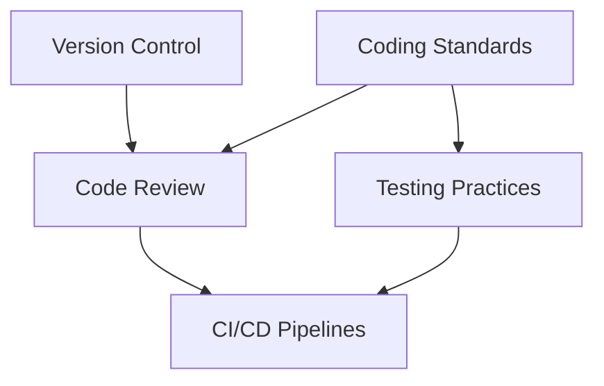
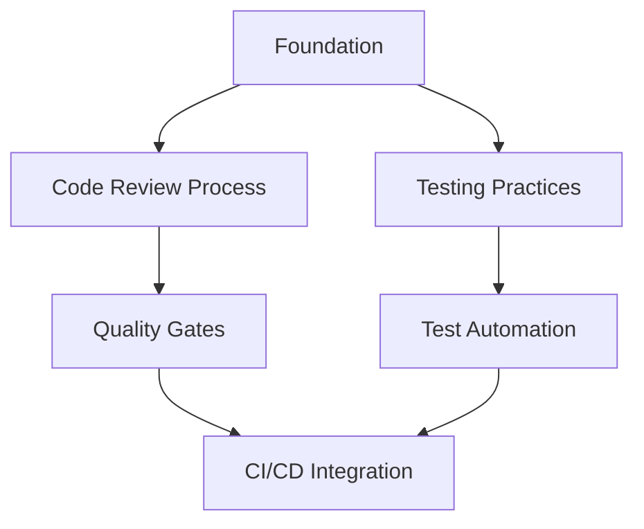
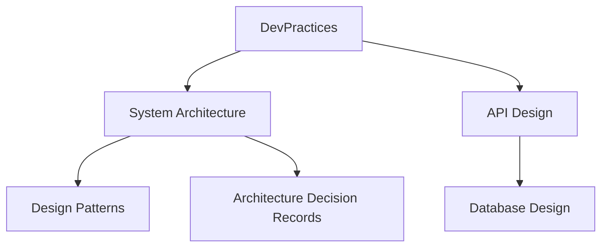
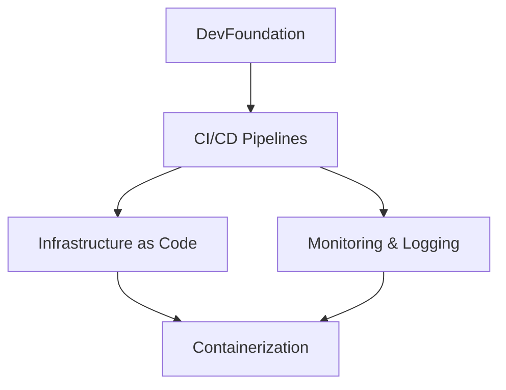
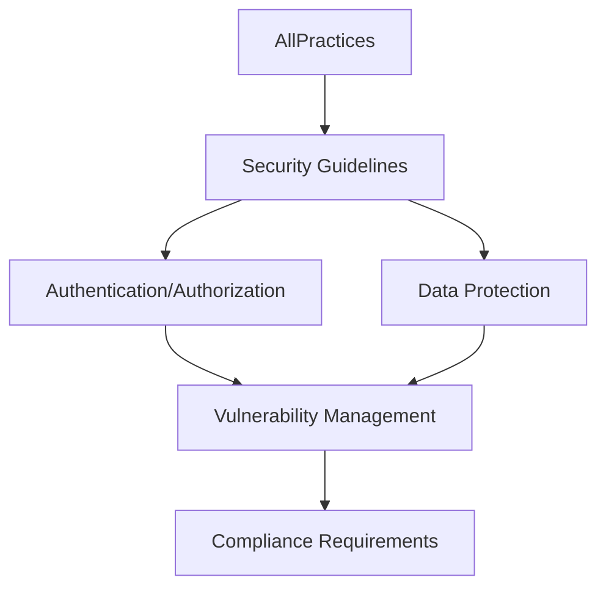

# Practice Dependencies & Learning Paths

This guide maps the relationships between engineering practices and provides structured learning paths for different experience levels and roles. Understanding these dependencies helps you build knowledge systematically and implement practices in the correct order.

## 🎯 Understanding Practice Dependencies

### Dependency Types

#### Prerequisites (Must Have First)
Practices that must be established before implementing others effectively.
```
Version Control → Code Review → Continuous Integration
```

#### Complementary (Work Better Together)
Practices that enhance each other when implemented together.
```
Testing Practices ↔ Code Quality Standards ↔ Code Review Process
```

#### Progressive (Build Upon Each Other)
Practices that represent increasing levels of sophistication.
```
Manual Testing → Automated Testing → Continuous Testing → Test-Driven Development
```

#### Supporting (Enable Advanced Practices)
Foundational practices that enable more complex implementations.
```
Monitoring/Logging → Performance Optimization → Reliability Engineering
```

## 🗺️ Complete Dependency Map

### Core Foundation Layer
These practices form the foundation for all other engineering activities:



**Essential Prerequisites:**
1. [`07-standards-guidelines/naming-conventions/`](07-standards-guidelines/naming-conventions/) - Basic naming standards
2. [`01-development-practices/version-control/`](01-development-practices/version-control/) - Version control practices
3. [`01-development-practices/coding-standards/`](01-development-practices/coding-standards/) - Code formatting and style
4. [`08-tools-technologies/environment-setup/`](08-tools-technologies/environment-setup/) - Development environment

### Development Practices Layer
Built on the foundation, these practices improve code quality and team collaboration:



**Implementation Order:**
1. [`01-development-practices/code-review-process/`](01-development-practices/code-review-process/) - Peer review workflows
2. [`01-development-practices/testing-practices/`](01-development-practices/testing-practices/) - Unit and integration testing
3. [`03-quality-assurance/testing-strategies/`](03-quality-assurance/testing-strategies/) - Comprehensive test planning
4. [`03-quality-assurance/automation/`](03-quality-assurance/automation/) - Automated testing frameworks

### Architecture & Design Layer
Advanced practices requiring solid development foundations:



**Implementation Order:**
1. [`02-architecture-design/system-architecture/`](02-architecture-design/system-architecture/) - System design principles
2. [`02-architecture-design/api-design/`](02-architecture-design/api-design/) - API design guidelines
3. [`02-architecture-design/design-patterns/`](02-architecture-design/design-patterns/) - Architectural patterns
4. [`02-architecture-design/database-design/`](02-architecture-design/database-design/) - Data architecture
5. [`02-architecture-design/decision-records/`](02-architecture-design/decision-records/) - ADR practices

### DevOps & Infrastructure Layer
Practices requiring stable development and architecture foundations:



**Implementation Order:**
1. [`04-devops-infrastructure/ci-cd-pipelines/`](04-devops-infrastructure/ci-cd-pipelines/) - Continuous integration/deployment
2. [`04-devops-infrastructure/monitoring-logging/`](04-devops-infrastructure/monitoring-logging/) - Observability practices
3. [`04-devops-infrastructure/infrastructure-as-code/`](04-devops-infrastructure/infrastructure-as-code/) - Infrastructure automation
4. [`04-devops-infrastructure/containerization/`](04-devops-infrastructure/containerization/) - Container orchestration

### Security & Compliance Layer
Cross-cutting practices that integrate with all other layers:



**Integration Points:**
1. [`05-security-practices/security-guidelines/`](05-security-practices/security-guidelines/) - Core security practices
2. [`05-security-practices/authentication-authorization/`](05-security-practices/authentication-authorization/) - Access control
3. [`05-security-practices/data-protection/`](05-security-practices/data-protection/) - Data security
4. [`05-security-practices/vulnerability-management/`](05-security-practices/vulnerability-management/) - Security monitoring
5. [`07-standards-guidelines/compliance-requirements/`](07-standards-guidelines/compliance-requirements/) - Regulatory compliance

## 🛤️ Learning Paths by Experience Level

### 🌱 Beginner Path (0-2 Years Experience)

#### Phase 1: Foundation (Weeks 1-4)
1. [`08-tools-technologies/environment-setup/`](08-tools-technologies/environment-setup/) - Set up development environment
2. [`07-standards-guidelines/naming-conventions/`](07-standards-guidelines/naming-conventions/) - Learn naming standards
3. [`01-development-practices/coding-standards/`](01-development-practices/coding-standards/) - Master code formatting
4. [`01-development-practices/version-control/`](01-development-practices/version-control/) - Git basics and workflows

#### Phase 2: Development Basics (Weeks 5-8)
1. [`01-development-practices/testing-practices/`](01-development-practices/testing-practices/) - Unit testing fundamentals
2. [`01-development-practices/code-review-process/`](01-development-practices/code-review-process/) - Participate in code reviews
3. [`07-standards-guidelines/file-organization/`](07-standards-guidelines/file-organization/) - Project structure
4. [`06-team-processes/communication-standards/`](06-team-processes/communication-standards/) - Team communication

#### Phase 3: Quality Focus (Weeks 9-12)
1. [`03-quality-assurance/bug-tracking/`](03-quality-assurance/bug-tracking/) - Issue management
2. [`07-standards-guidelines/code-quality/`](07-standards-guidelines/code-quality/) - Code quality metrics
3. [`09-reference-materials/checklists/`](09-reference-materials/checklists/) - Use quality checklists
4. [`08-tools-technologies/tool-specific-practices/`](08-tools-technologies/tool-specific-practices/) - Master development tools

### 🚀 Intermediate Path (2-5 Years Experience)

#### Phase 1: Advanced Development (Months 1-2)
1. [`01-development-practices/testing-practices/`](01-development-practices/testing-practices/) - Advanced testing patterns
2. [`03-quality-assurance/automation/`](03-quality-assurance/automation/) - Test automation frameworks
3. [`04-devops-infrastructure/ci-cd-pipelines/`](04-devops-infrastructure/ci-cd-pipelines/) - Build pipeline skills
4. [`05-security-practices/security-guidelines/`](05-security-practices/security-guidelines/) - Security awareness

#### Phase 2: Architecture Understanding (Months 3-4)
1. [`02-architecture-design/system-architecture/`](02-architecture-design/system-architecture/) - System design basics
2. [`02-architecture-design/api-design/`](02-architecture-design/api-design/) - API design principles
3. [`02-architecture-design/design-patterns/`](02-architecture-design/design-patterns/) - Common patterns
4. [`02-architecture-design/database-design/`](02-architecture-design/database-design/) - Data modeling

#### Phase 3: Process Mastery (Months 5-6)
1. [`03-quality-assurance/testing-strategies/`](03-quality-assurance/testing-strategies/) - Test strategy development
2. [`04-devops-infrastructure/monitoring-logging/`](04-devops-infrastructure/monitoring-logging/) - Observability practices
3. [`06-team-processes/agile-processes/`](06-team-processes/agile-processes/) - Agile methodologies
4. [`02-architecture-design/decision-records/`](02-architecture-design/decision-records/) - Technical decisions

### 🏗️ Advanced Path (5+ Years Experience)

#### Phase 1: Leadership Foundation (Months 1-3)
1. [`02-architecture-design/decision-records/`](02-architecture-design/decision-records/) - Master ADR practices
2. [`06-team-processes/performance-reviews/`](06-team-processes/performance-reviews/) - Performance management
3. [`03-quality-assurance/quality-metrics/`](03-quality-assurance/quality-metrics/) - Quality measurement
4. [`08-tools-technologies/technology-stack/`](08-tools-technologies/technology-stack/) - Technology selection

#### Phase 2: Systems Thinking (Months 4-6)
1. [`02-architecture-design/system-architecture/`](02-architecture-design/system-architecture/) - Advanced system design
2. [`04-devops-infrastructure/infrastructure-as-code/`](04-devops-infrastructure/infrastructure-as-code/) - Infrastructure automation
3. [`05-security-practices/vulnerability-management/`](05-security-practices/vulnerability-management/) - Security architecture
4. [`07-standards-guidelines/compliance-requirements/`](07-standards-guidelines/compliance-requirements/) - Compliance leadership

#### Phase 3: Organizational Impact (Months 7-12)
1. [`06-team-processes/onboarding/`](06-team-processes/onboarding/) - Team scaling practices
2. [`09-reference-materials/decision-matrices/`](09-reference-materials/decision-matrices/) - Strategic decision-making
3. [`08-tools-technologies/tool-recommendations/`](08-tools-technologies/tool-recommendations/) - Tool evaluation
4. [`CONTRIBUTING.md`](CONTRIBUTING.md) - Knowledge sharing leadership

## 🎭 Learning Paths by Role

### 👩‍💻 Software Developer Focus

#### Core Path (All Levels)
1. **Foundation**: [`01-development-practices/`](01-development-practices/) - All subdirectories
2. **Quality**: [`03-quality-assurance/testing-strategies/`](03-quality-assurance/testing-strategies/) + [`03-quality-assurance/automation/`](03-quality-assurance/automation/)
3. **Standards**: [`07-standards-guidelines/`](07-standards-guidelines/) - Focus on code-quality and naming-conventions
4. **Tools**: [`08-tools-technologies/environment-setup/`](08-tools-technologies/environment-setup/) + [`08-tools-technologies/tool-specific-practices/`](08-tools-technologies/tool-specific-practices/)

#### Growth Areas
- **Architecture**: [`02-architecture-design/design-patterns/`](02-architecture-design/design-patterns/) → [`02-architecture-design/api-design/`](02-architecture-design/api-design/)
- **DevOps**: [`04-devops-infrastructure/ci-cd-pipelines/`](04-devops-infrastructure/ci-cd-pipelines/) → [`04-devops-infrastructure/monitoring-logging/`](04-devops-infrastructure/monitoring-logging/)
- **Security**: [`05-security-practices/security-guidelines/`](05-security-practices/security-guidelines/) → [`05-security-practices/data-protection/`](05-security-practices/data-protection/)

### 🏗️ Solution Architect Focus

#### Core Path (All Levels)
1. **Architecture**: [`02-architecture-design/`](02-architecture-design/) - All subdirectories in order
2. **Decisions**: [`02-architecture-design/decision-records/`](02-architecture-design/decision-records/) - Master first
3. **Security**: [`05-security-practices/security-guidelines/`](05-security-practices/security-guidelines/) → [`05-security-practices/authentication-authorization/`](05-security-practices/authentication-authorization/)
4. **Quality**: [`03-quality-assurance/quality-metrics/`](03-quality-assurance/quality-metrics/) + [`07-standards-guidelines/compliance-requirements/`](07-standards-guidelines/compliance-requirements/)

#### Supporting Areas
- **Development**: [`01-development-practices/code-review-process/`](01-development-practices/code-review-process/) for quality oversight
- **DevOps**: [`04-devops-infrastructure/infrastructure-as-code/`](04-devops-infrastructure/infrastructure-as-code/) for deployment architecture
- **Tools**: [`08-tools-technologies/technology-stack/`](08-tools-technologies/technology-stack/) for technology decisions

### 🔧 DevOps Engineer Focus

#### Core Path (All Levels)
1. **Infrastructure**: [`04-devops-infrastructure/`](04-devops-infrastructure/) - All subdirectories
2. **Security**: [`05-security-practices/`](05-security-practices/) - Focus on automation aspects
3. **Quality**: [`03-quality-assurance/automation/`](03-quality-assurance/automation/) + [`03-quality-assurance/quality-metrics/`](03-quality-assurance/quality-metrics/)
4. **Tools**: [`08-tools-technologies/`](08-tools-technologies/) - All subdirectories

#### Integration Areas
- **Development**: [`01-development-practices/version-control/`](01-development-practices/version-control/) for pipeline integration
- **Architecture**: [`02-architecture-design/system-architecture/`](02-architecture-design/system-architecture/) for infrastructure design
- **Compliance**: [`07-standards-guidelines/compliance-requirements/`](07-standards-guidelines/compliance-requirements/) for automated compliance

### 🧪 QA Engineer Focus

#### Core Path (All Levels)
1. **Testing**: [`03-quality-assurance/`](03-quality-assurance/) - All subdirectories in order
2. **Development**: [`01-development-practices/testing-practices/`](01-development-practices/testing-practices/) for collaboration
3. **Automation**: [`03-quality-assurance/automation/`](03-quality-assurance/automation/) → [`04-devops-infrastructure/ci-cd-pipelines/`](04-devops-infrastructure/ci-cd-pipelines/)
4. **Standards**: [`07-standards-guidelines/code-quality/`](07-standards-guidelines/code-quality/) + [`09-reference-materials/checklists/`](09-reference-materials/checklists/)

#### Expansion Areas
- **Security**: [`05-security-practices/vulnerability-management/`](05-security-practices/vulnerability-management/) for security testing
- **Performance**: [`04-devops-infrastructure/monitoring-logging/`](04-devops-infrastructure/monitoring-logging/) for performance testing
- **Process**: [`06-team-processes/agile-processes/`](06-team-processes/agile-processes/) for QA integration

## 🔄 Implementation Strategies

### Gradual Implementation
For teams new to structured practices:

#### Month 1-2: Foundation
- Establish [`01-development-practices/version-control/`](01-development-practices/version-control/) workflows
- Implement basic [`01-development-practices/coding-standards/`](01-development-practices/coding-standards/)
- Set up [`08-tools-technologies/environment-setup/`](08-tools-technologies/environment-setup/) consistency

#### Month 3-4: Quality Gates
- Introduce [`01-development-practices/code-review-process/`](01-development-practices/code-review-process/)
- Begin [`01-development-practices/testing-practices/`](01-development-practices/testing-practices/) adoption
- Establish [`03-quality-assurance/bug-tracking/`](03-quality-assurance/bug-tracking/) processes

#### Month 5-6: Automation
- Implement [`04-devops-infrastructure/ci-cd-pipelines/`](04-devops-infrastructure/ci-cd-pipelines/)
- Expand [`03-quality-assurance/automation/`](03-quality-assurance/automation/)
- Add [`04-devops-infrastructure/monitoring-logging/`](04-devops-infrastructure/monitoring-logging/) basics

### Parallel Implementation
For mature teams adding specific practices:

#### Architecture Track
1. [`02-architecture-design/decision-records/`](02-architecture-design/decision-records/) - Start immediately
2. [`02-architecture-design/system-architecture/`](02-architecture-design/system-architecture/) - Parallel development
3. [`02-architecture-design/api-design/`](02-architecture-design/api-design/) - Build on architecture

#### Security Track
1. [`05-security-practices/security-guidelines/`](05-security-practices/security-guidelines/) - Baseline security
2. [`05-security-practices/authentication-authorization/`](05-security-practices/authentication-authorization/) - Access control
3. [`05-security-practices/vulnerability-management/`](05-security-practices/vulnerability-management/) - Continuous security

## 📊 Progress Tracking

### Competency Matrices
Use [`09-reference-materials/decision-matrices/`](09-reference-materials/decision-matrices/) to track:
- Individual skill development
- Team practice adoption
- Practice maturity levels
- Implementation readiness

### Learning Milestones
Track progress through:
- **Knowledge**: Understanding of practice principles
- **Application**: Successful implementation in projects
- **Teaching**: Ability to mentor others in the practice
- **Innovation**: Contributing improvements to the practice

### Dependencies Checklist
Before implementing any practice, verify:
- [ ] Prerequisite practices are established
- [ ] Team has necessary skills and tools
- [ ] Supporting infrastructure is in place
- [ ] Success metrics are defined
- [ ] Review and improvement process is planned

---

**Next Steps:**
1. Assess current practice maturity using [`09-reference-materials/decision-matrices/`](09-reference-materials/decision-matrices/)
2. Choose appropriate learning path based on role and experience
3. Follow implementation order for selected practices
4. Use [`tags-index.md`](tags-index.md) to find supporting materials
5. Contribute lessons learned back to this handbook via [`CONTRIBUTING.md`](CONTRIBUTING.md)